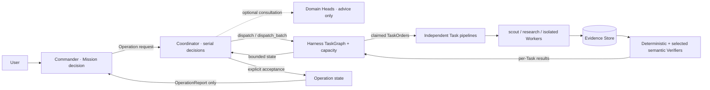
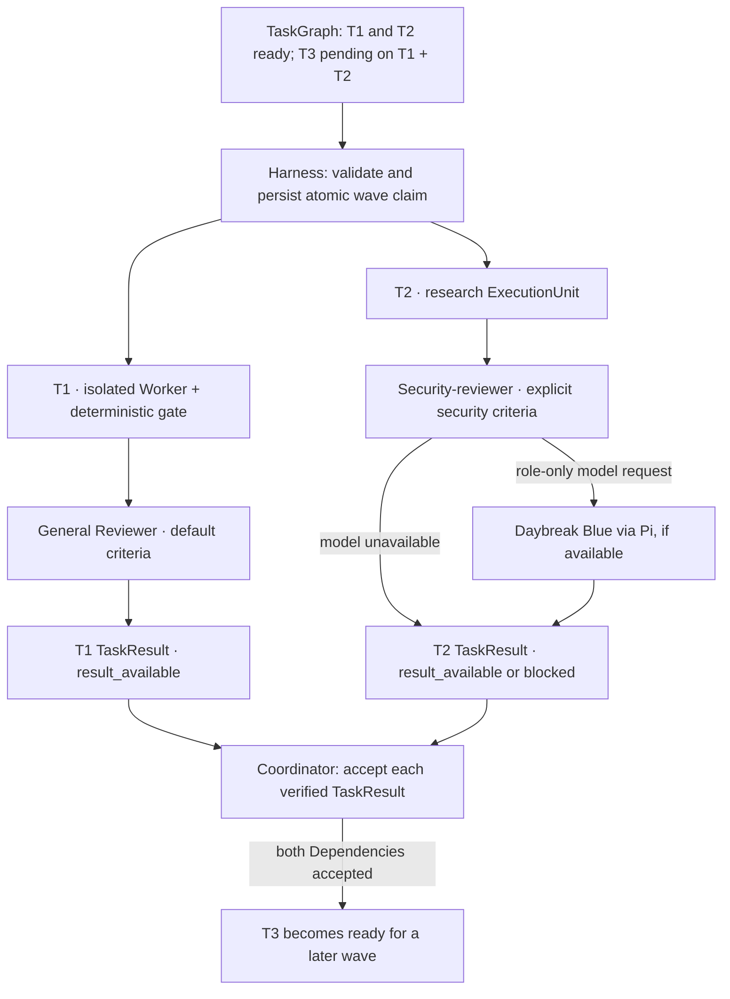

# Pi Harness

Pi-native harness and extension for **Pi 0.85.1**. Provides read-only planning (`/plan`), evidence-backed goal tracking (`/goal`), managed Operations with bounded parallel Task waves, curated skills, and an Agent Client Protocol (ACP) bridge for editors like Zed. Child execution uses `@tintinweb/pi-subagents@0.19.0`.

---

## Features

- **Read-Only Planning Mode (`/plan on|off|status`)**: Strips mutating tools (`edit`, `write`), blocks mutating bash syntax (e.g. `sed -i`, redirects, file deletions), and prompts the agent to provide assumptions, steps, and verification gates. Lifecycle tests cover persisted reload, real compaction, real fork/branch independence, and mutation blocking after transitions.
- **Evidence-Backed Goal (`/goal <objective>`)**: Tracks a single active objective requiring concrete verification evidence and blockers for terminal transitions. It does not provide wait, pause/resume, token-budget, or strong no-progress circuit-breaker states.
- **Safe proactive compaction (`/harness-compact set <50-90>|status|disable`)**: Enabled by default at **70% of the active model's context window**. A whole-number threshold from 50% to 90% can override the default and is stored in the Pi session; `disable` is also persisted. Crossing it only queues a request; Harness waits for an idle `agent_settled` boundary with no active tools, TaskOrders, or Reviewer before calling Pi's compaction API. Goal continuation waits for compaction success or failure. After either outcome, Harness will not retry until usage first drops below the threshold. This is separate from Pi's `/autocompact`, which remains enabled and handles mid-run/emergency compaction. Session switches reset pending work but restore the saved threshold.
- **Skills**: Pi Harness owns the skills checked into `skills/`. `skills/skills.lock.json` records SHA-256 checksums for every packaged skill file; verification is self-contained and does not require another repository, source commit, or upstream checkout. Public promotions become canonical here; adapted skills follow current Pi Harness behavior. The skill set includes reusable workflows for clarification, requirement checks, architecture/formal draw.io models, atomic commits, delegation, repository scouting, writing/review, and caveman/ponytail modes.
- **Managed Operations**: A separate Coordinator proposes TaskOrders and optional Domain Heads give bounded advice. The Harness TaskGraph checks Dependencies and retry budgets, claims ready Tasks, runs independent Task pipelines in bounded parallel waves, and persists each TaskResult separately. The Coordinator must explicitly accept verified TaskResults; Operation completion does not complete the Mission. The Commander receives a bounded OperationReport, not Worker transcripts.
- **Isolated verification**: Harness runs deterministic Worker gates and commit checks before selected semantic criteria reach the general Reviewer or the packet-only security-reviewer. A TaskOrder routes security criteria only through an explicit `review_profile: { "exact criterion": "security" }`. The security reviewer requests Daybreak Blue only if the model is available in Pi; otherwise verification is blocked, with no silent fallback. `/skill:security` is explicit-only reasoning guidance and does not change the model or dispatch a reviewer. Worker branches remain separate; Harness never auto-integrates them. See `target-architecture.md` for the contracts and boundaries.
- **ACP Stdio Bridge (`pi-harness-acp`)**: Connects Pi with Zed Editor or any ACP client over JSON-RPC stdio, advertises Harness commands, forwards Pi events, persists session mappings, relays cancellation, and passes pasted/dragged images plus text-file resources to Pi.
- **Project Memory (`/learn <note>`)**: Retains user-saved rules and lessons in owner-only local files at `~/.pi-harness/memory/<project-hash>.md`, outside the repository. Loaded memory is sent with the prompt to the active model provider.

Other skill directories are ignored by Git and excluded from the package file list. Review the package contents before publishing this checkout.

---

## Clients

Pi Harness is the shared Pi extension and ACP bridge. Clients stay separate:

- **Zed** connects to `pi-harness-acp` as an editor client.
- **WPi** is an independent terminal UI app that also connects to `pi-harness-acp`; see the WPi repository README for its setup.

Each client starts its own ACP process and session. WPi is not packaged inside Pi Harness and does not import Harness source or private state files.

In Pi's native terminal, use `Ctrl+V` (`Alt+V` on Windows/WSL) for clipboard images or text, drag images from the file manager into a supported terminal, and type `@` to attach text/code files. ACP clients can send standard text, image, embedded-resource, and local `resource_link` content blocks; the bridge forwards images and includes text-file contents in the Pi prompt.

## Ownership

```text
Pi 0.85.1
├── provider, model, authentication, local runtime, session tree, compaction
├── Pi Harness
│   ├── plan, goal, explicit project memory, precise editing
│   ├── code intelligence, skill loading/provenance, bounded web CLI
│   ├── bootstrap, doctor, and compatibility policy
│   ├── TaskGraph readiness, parallel capacity, Evidence, verification
│   └── Coordinator, Operation acceptance, and ACP compatibility policy
├── @tintinweb/pi-subagents@0.19.0
│   └── child lifecycle, package capacity, worktrees, and cancellation
└── ACP
    └── Pi Harness: ACP bridge and Harness command compatibility
```

### Managed Operation: reasoning and execution boundaries



The Coordinator and Heads select or advise; they do not own capacity or child lifecycle. Harness persists a `running` claim **before** it starts a child. Pi owns provider configuration and authentication; pi-subagents owns child lifecycle and Worker worktrees. Raw Evidence and child transcripts do not enter the Commander or Coordinator context.

### Parallel wave and security routing



Harness defaults to **2 active Task pipelines** per managed Operation (maximum **4** via `PI_HARNESS_MAX_PARALLEL_TASKS=1..4`); `.pi/subagents.json` permits four background children but does not decide TaskGraph readiness. A Task pipeline includes its verification children. The Coordinator waits for the whole wave before its next decision; Harness persists each TaskResult as it arrives. `verified` does not mean parallel Worker branches are merge-compatible. If Daybreak is unavailable, only the selected security verification is blocked; Harness does not route it to the general Reviewer.

---

## Quick Setup (Zero-Config)

### Multi-Device Setup (PC, Laptop, Mini PC)

On any machine with Node.js 22+ and Pi installed:

```bash
# 1. Clone repository
git clone git@github.com:WillGle/pi-harness.git ~/dev/pi-harness
cd ~/dev/pi-harness

# 2. Run automated bootstrap
npm run bootstrap
```

The bootstrap script automatically:

1. Installs the extension and curated skills into Pi via `pi install .`.
2. Installs the `pi-harness-acp` binary globally.
3. Automatically configures Zed Editor (`~/.config/zed/settings.json`) with rollback backup and fingerprint protection.

Use this when Zed integration is wanted too. It is not required to use WPi.

### Pi CLI Only

On a machine without Zed, install only the Pi package:

```bash
npm run bootstrap -- --cli
npm run doctor
```

### WPi Terminal Client

Install the Harness extension and expose the ACP bridge once:

```bash
cd ~/dev/pi-harness
pi install .

cd packages/pi-harness-acp
npm link
```

Then install and expose the separate WPi app:

```bash
cd ~/dev/pi-harness-tui
npm install
npm link
pi-tui
```

`pi-tui` starts WPi and its ACP child process. Do not start `pi-harness-acp` separately for that terminal. If the ACP bridge is not on `PATH` during local development, start WPi with:

```bash
PI_HARNESS_ACP_BIN=~/dev/pi-harness/packages/pi-harness-acp/bin/pi-harness-acp.mjs npm start
```

---

## Verification & Diagnostics

Verify system readiness at any time:

```bash
# Check Pi CLI readiness
npm run doctor

# Also require ACP and Zed readiness
npm run doctor -- --zed

# Build and run unit/integration tests
npm run build
npm test
npm run test:integration

# Verify locally canonical skill package checksums
npm run verify:skills

# Inspect the exact files included before distributing a package
npm pack --dry-run --json
```

---

## License

MIT
