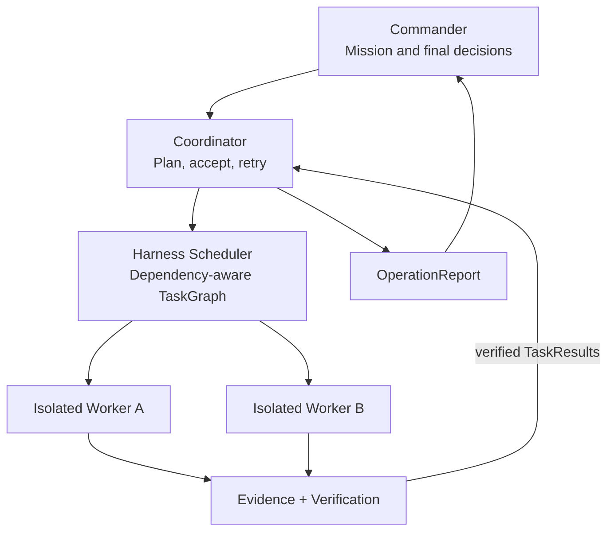

# Pi Harness

Pi Harness is a control plane for Pi that keeps long-running coding work bounded: it isolates Worker context, checks Evidence before acceptance, and returns concise reports to the Commander.


```mermaid
flowchart TD
    M["Commander<br/>Mission and final decisions"] --> C["Coordinator<br/>Plan, accept, retry"]
    C --> S["Harness Scheduler<br/>Dependency-aware TaskGraph"]
    S --> A["Isolated Worker A"]
    S --> B["Isolated Worker B"]
    A --> E["Evidence + Verification"]
    B --> E
    E -->|verified TaskResults| C
    C --> R["OperationReport"]
    R --> M
```

## Why this exists

| Problem | Pi Harness solution |
|---|---|
| Worker logs flood the main agent context | Workers use disposable contexts; the Commander receives a bounded `OperationReport`, not Worker transcripts. |
| Agents report completion without proof | Harness stores Evidence and checks Acceptance Criteria before a TaskResult can be verified. The Coordinator must accept verified TaskResults explicitly. |
| Delegated agents recursively control other agents | Harness validates dispatch; `pi-subagents` manages child execution. Workers do not own scheduling. |
| Parallel Workers race or corrupt state | A persistent, dependency-aware TaskGraph, atomic claims, isolated worktrees, and session guards protect execution. |
| The parent agent receives implementation noise | The Coordinator promotes semantic TaskResults; the Commander receives only the bounded OperationReport. |
| Security review can use the wrong review path | Exact criterion routing and fail-closed verification prevent silent reviewer fallback. |

## How it works

A Commander defines a Mission. A Coordinator plans bounded Tasks and decides whether to dispatch, retry, or accept results. The Harness Scheduler checks Dependencies and dispatches eligible Tasks to isolated Workers. Harness stores Evidence and verifies Acceptance Criteria. The Coordinator accepts verified TaskResults into the Operation, then returns an OperationReport to the Commander.

Execution completion is not verification. Verification is not Operation acceptance. Operation completion does not complete the Mission.

## What it is useful for

### Large repository changes

Give the Commander one Mission. The Coordinator divides it into Tasks. Independent Workers can run in parallel, and only verified results return.

### Long-running coding sessions

Keep mechanical investigation and implementation inside Worker contexts instead of growing the Commander context with every log and intermediate step.

### Changes that require proof

A Worker finishing execution is not success by itself. Harness stores Evidence, runs verification, and requires explicit Coordinator acceptance of each verified TaskResult.

## Key capabilities

- Persistent, dependency-aware TaskGraph.
- Bounded parallel execution in isolated worktrees.
- Separate Commander, Coordinator, and Worker contexts.
- Evidence-backed deterministic and selected semantic verification.
- Explicit TaskResult acceptance and bounded OperationReports.
- Safe session switching, cancellation, and compaction lifecycle.

Pi Harness also provides `/plan`, `/goal`, curated skills, and `pi-harness-acp` for ACP-compatible clients.

## Quick start

Requirements: Node.js 22.19 or later and Pi 0.87.1.

```bash
git clone https://github.com/WillGle/pi-harness.git
cd pi-harness
npm install
npm run bootstrap -- --cli
npm run doctor
```

Then run `pi`. To install the ACP bridge and configure Zed, run `npm run bootstrap` without `--cli`; the Zed settings file must already exist.

## Architecture

See [target-architecture.md](target-architecture.md) for authority, lifecycle, state, and verification contracts.

## Status and limitations

Managed Operations, bounded parallel Task waves, Evidence-backed verification, and session-safe cancellation are shipped. Dynamic TaskGraph expansion, automatic branch integration, automatic Mission completion, and persistent project intelligence are not shipped. The working implementation uses native stable prompts, deterministic Context GC, and availability-aware context telemetry; release closure and broader live scenario proof remain pending. An Operation completing does not complete the Mission.

## Development and testing

Run these checks from the repository root:

```bash
npm run build
npm test
npm run test:integration
npm run verify:skills
```
