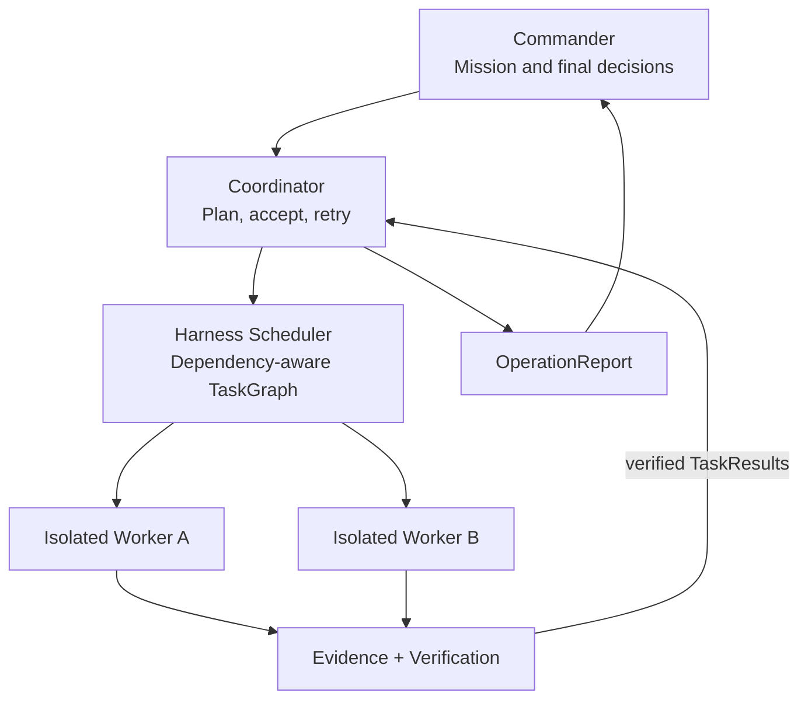

# Pi Harness

Pi Harness is a control plane for Pi that keeps long-running coding work bounded: it isolates Worker context, checks Evidence before acceptance, and returns concise reports to the Commander.


```mermaid
flowchart TD
    M["Commander<br/>Mission and final decisions"] --> C["Coordinator<br/>Plan, accept, retry"]
    C --> S["Harness Scheduler<br/>Dependency-aware TaskGraph"]
    S --> A["Isolated Worker A"]
    S --> B["Isolated Worker B"]
    A --> E["Evidence + Verification"]
    B --> E
    E -->|verified TaskResults| C
    C --> R["OperationReport"]
    R --> M
```

## Why this exists

| Problem | Pi Harness solution |
|---|---|
| Worker logs flood the main agent context | Workers use disposable contexts; the Commander receives a bounded `OperationReport`, not Worker transcripts. |
| Agents report completion without proof | Harness stores Evidence and checks Acceptance Criteria before a TaskResult can be verified. The Coordinator must accept verified TaskResults explicitly. |
| Delegated agents recursively control other agents | Harness validates dispatch; `pi-subagents` manages child execution. Workers do not own scheduling. |
| Parallel Workers race or corrupt state | A persistent, dependency-aware TaskGraph, atomic claims, isolated worktrees, and session guards protect execution. |
| The parent agent receives implementation noise | The Coordinator promotes semantic TaskResults; the Commander receives only the bounded OperationReport. |
| Security review can use the wrong review path | Exact criterion routing and fail-closed verification prevent silent reviewer fallback. |

## How it works

A Commander defines a Mission. A Coordinator plans bounded Tasks and decides whether to dispatch, retry, or accept results. The Harness Scheduler checks Dependencies and dispatches eligible Tasks to isolated Workers. Harness stores Evidence and verifies Acceptance Criteria. The Coordinator accepts verified TaskResults into the Operation, then returns an OperationReport to the Commander.

Execution completion is not verification. Verification is not Operation acceptance. Operation completion does not complete the Mission.

## What it is useful for

### Large repository changes

Give the Commander one Mission. The Coordinator divides it into Tasks. Independent Workers can run in parallel, and only verified results return.

### Long-running coding sessions

Keep mechanical investigation and implementation inside Worker contexts instead of growing the Commander context with every log and intermediate step.

### Changes that require proof

A Worker finishing execution is not success by itself. Harness stores Evidence, runs verification, and requires explicit Coordinator acceptance of each verified TaskResult.

## Key capabilities

- Mission-owned Operations, durable Attempt Ledger, and dependency-aware TaskGraph.
- Bounded replaceable Mission Situation Board for unresolved obligations.
- Bounded parallel execution in isolated worktrees.
- Separate Commander, Coordinator, and Worker contexts.
- Evidence-backed deterministic and selected semantic verification.
- Explicit TaskResult acceptance and bounded OperationReports.
- Safe session switching, cancellation, and compaction lifecycle.

Pi Harness also provides `/plan`, `/goal`, and curated skills. The separate `pi-harness-acp` bridge is experimental and outside the supported product surface.

## Platform support

Pi Harness supports Linux CLI environments only. The supported interface is Pi running in a Linux terminal. Harness relies on Linux/POSIX process groups, signals, shell behavior, filesystem permissions, symlink semantics, and Git worktrees.

macOS, Windows, WSL, GUI clients, and ACP/editor integrations are outside the supported platform contract unless they are separately scoped and runtime-verified. Unsupported hosts must fail closed. Harness must not weaken lifecycle, isolation, or verification guarantees when a required capability is missing.

### Requirements

- Linux
- Node.js `>=22.19.0`
- Pi `0.87.1`
- Git
- POSIX `sh`
- ripgrep (`rg`)
- npm for bootstrap and package installation

`npm run doctor` checks the runtime, command prerequisites, filesystem safety, process groups, and disposable Git worktree support. Universal Ctags and ast-grep are optional. Code-intel tools use ripgrep when those tools are unavailable. Ubuntu 24.04 GitHub Actions passed on commit `8196c5b` ([run #36453820891](https://github.com/WillGle/pi-harness/actions/runs/36453820891)). A local Ubuntu 24.04 container with stock Pi 0.87.1 also passed the workflow-equivalent gates. A generic Linux host remains unverified.

## Quick start

```bash
git clone https://github.com/WillGle/pi-harness.git
cd pi-harness
npm install
npm run bootstrap
npm run doctor
```

Then run `pi` in a Linux terminal. Bootstrap installs Pi Harness for the Pi CLI by default. The ACP bridge and Zed setup remain experimental ancillary integrations, are not supported surfaces, and require the explicit `npm run bootstrap -- --experimental-zed` option. See [UPSTREAM.md](packages/pi-harness-acp/UPSTREAM.md) for their tested limits; no full official ACP conformance claim is made.

## Architecture

See [target-architecture.md](target-architecture.md) for authority, lifecycle, state, and verification contracts.

## Status and limitations

Coordinator-owned Task planning, bounded parallel Task waves, Evidence-backed verification, and session-safe cancellation are shipped for Linux CLI environments only. The Commander creates a task-less planning Operation. The Coordinator returns `plan_tasks` semantic proposals. Harness materializes IDs, Dependencies, and trusted execution policies atomically before it opens the TaskGraph for dispatch. Runtime TaskGraph expansion after that materialization, automatic branch integration, automatic Mission completion, and persistent project intelligence are not shipped. The working implementation uses native stable prompts, Mission-owned obligation state, deterministic Context GC, a replaceable Mission Situation Board, and availability-aware context telemetry; #41 Linux CLI TUI stability remains a release blocker. Harness-owned verification commands run with host permissions and environment. Git worktrees and process groups are not OS sandboxes. An Operation completing does not complete the Mission.

## Development and testing

Run these checks from the repository root:

```bash
npm run build
npm test
npm run test:integration
npm run verify:skills
```
